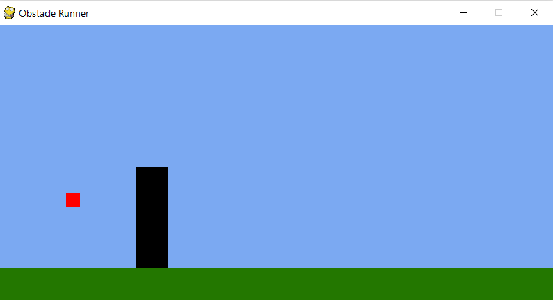

# Obstacle Runner

This is my first game built using pygame modules. It uses simple vector graphics to simulate the Chrome dino game.



## Get Started
Python and pip module `pygame` must be installed, otherwise do
```
pip install pygame
```

For window, simply double-click on `obstacle_runner.py`. For Unix or MacOS, run 
```
python obstacle_runner.py
```
